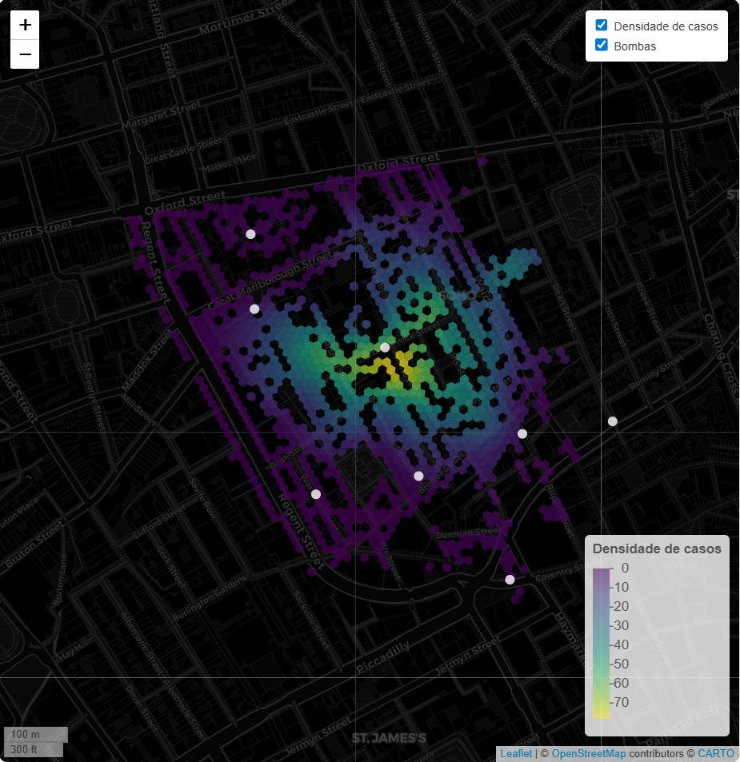

# John Snow: análise espacial da epidemia de cólera

Este projeto reproduz, com R, a análise espacial realizada por John Snow durante
a epidemia de cólera em Londres, em 1854. O código combina os registros
históricos de óbitos com a localização das bombas d'água para explorar a relação
entre mortalidade e distância até as bombas.

## O que o projeto faz

- baixa e extrai o conjunto de dados histórico do GeoDa Center;
- lê os dados geográficos com `sf`;
- calcula uma estimativa de densidade de Kernel (KDE) em uma grade hexagonal,
-  ponderada pelo número de óbitos;
- cria um mapa interativo com `leaflet`, mostrando a densidade de casos e as
	bombas d'água.

## Resultado



A imagem acima é uma captura estática do mapa produzido pelo projeto. As cores
representam a densidade estimada de óbitos e os pontos claros indicam as bombas
d'água. Ao executar `index.R`, o mapa completo continua disponível de forma
interativa, com camadas, escala, legenda e detalhes ao passar o cursor ou abrir
os pop-ups.

## Conceitos espaciais

O KDE é calculado depois da transformação dos dados para o `EPSG:27700`, um
sistema de coordenadas projetado para a região do Reino Unido. Como suas
unidades são metros, ele permite que as distâncias e a largura de banda do KDE
sejam calculadas em uma escala adequada. Depois do cálculo, os dados retornam
para o `EPSG:4326`, usado pelo mapa web.

O parâmetro `bandwidth_adjust = 0.5` controla o nível de suavização da
estimativa. Um valor menor produz hotspots mais locais e detalhados; um valor
maior gera uma superfície mais suave e generalizada. Neste projeto, `0.5` foi
mantido como uma escolha didática para evidenciar a concentração dos óbitos ao
redor da bomba de Broad Street. Essa visualização indica uma associação
espacial, mas não constitui, sozinha, uma prova causal.

## Requisitos

- R 4.5.1 ou compatível;
- um ambiente com acesso à internet para baixar os dados na primeira execução.

As dependências do projeto são gerenciadas pelo [`renv`](https://rstudio.github.io/renv/).

## Como executar

Na raiz do projeto, abra o R ou o RStudio e restaure as dependências:

```r
renv::restore()
```

Depois, execute o script principal:

```r
source("index.R")
```

O script cria `data/raw/` quando necessário, baixa `snow.zip`, extrai os arquivos
geográficos e retorna o mapa interativo. Se o arquivo ZIP já existir, o download
não será repetido.

Para consultar as análises exploratórias, correlações e gráficos adicionais:

```r
source("scripts/draft.R")
```

## Organização

```text
.
├── index.R          # análise principal e mapa KDE interativo
├── docs/mapa-kde.png # captura do resultado
├── scripts/draft.R  # análises exploratórias
├── renv.lock        # versões das dependências
├── renv/             # configuração de inicialização do renv
└── data/             # dados baixados localmente, não versionados
```

A pasta `data/` está no `.gitignore` porque os arquivos são obtidos
automaticamente pelo script. O arquivo `renv.lock` deve ser mantido versionado
para tornar o ambiente reprodutível.

## Fonte dos dados

Os dados históricos são disponibilizados pelo [GeoDa Center for Geospatial
Analysis and Computation](https://geodacenter.github.io/data-and-lab/snow/), da
University of Chicago.

## Licença e atribuição

Este repositório é um projeto educacional. Consulte a fonte original para as
condições de uso e a atribuição dos dados.
